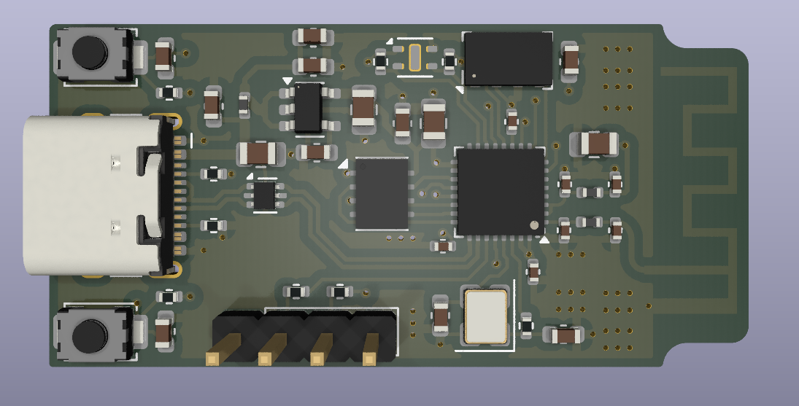
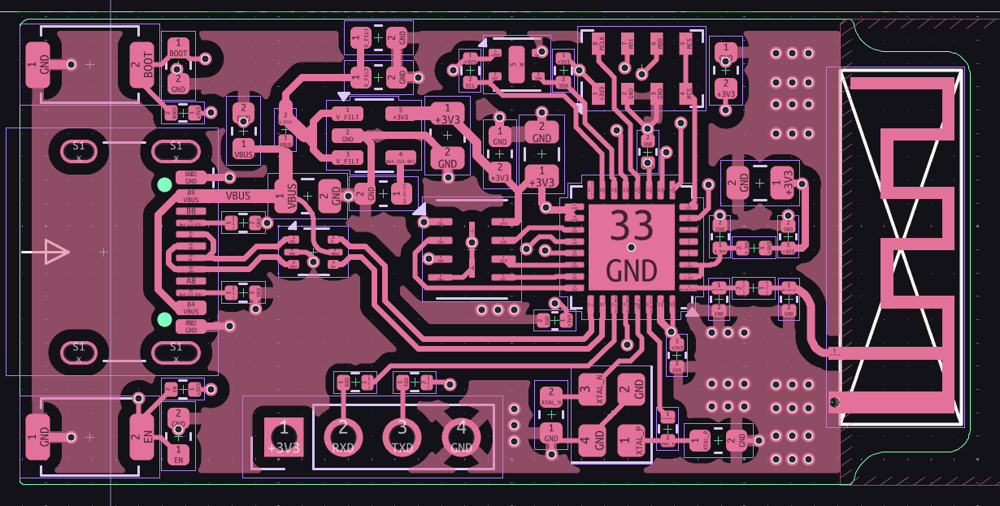
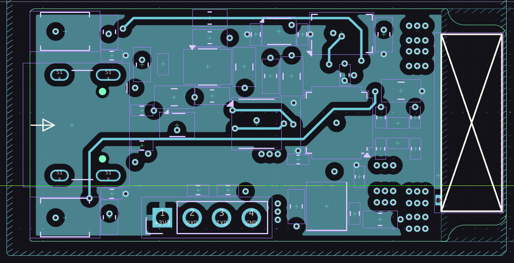
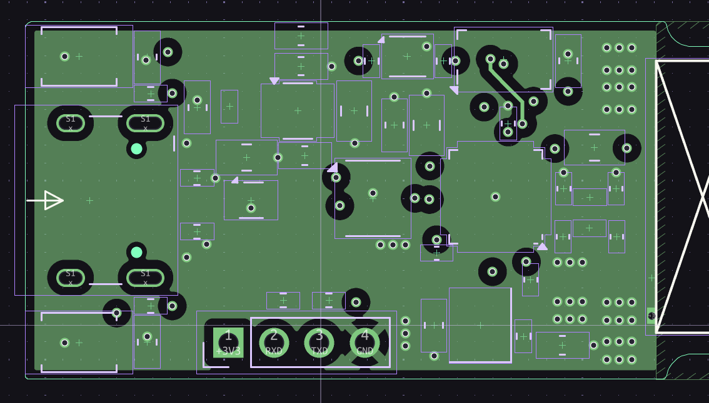
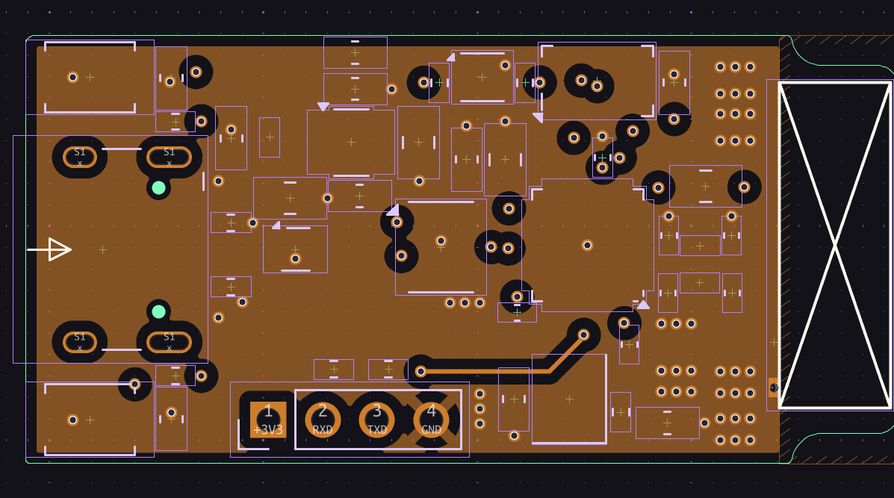
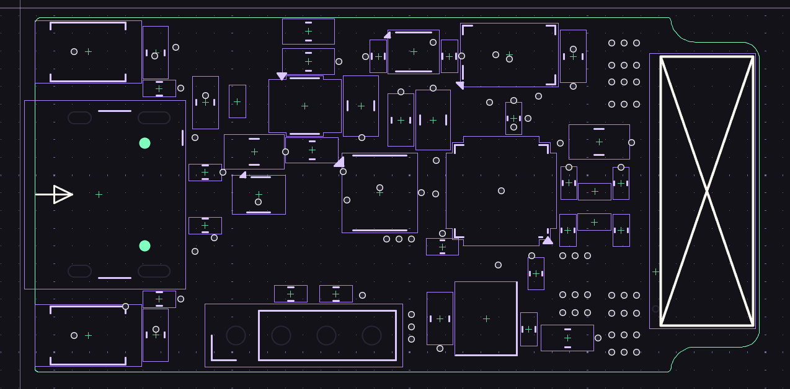

# ESP32-C3 Custom Development Board

A compact, custom-designed ESP32-C3 development board with USB-C connectivity, onboard antenna, and a clean two-layer PCB layout. Built for prototyping IoT and embedded applications without the bulk.

---

## 3D Render

The board features a USB-C connector on the left side, two tactile switches (BOOT and EN), the ESP32-C3 QFN package at the center-right, a PCB trace antenna on the far right, and a 4-pin UART header (3V3, RXD, TXD, GND) along the bottom edge. All passives are 0402/0603 for a tight layout.

---

## PCB Layout

### 3d Render

### Front Copper

### Back Copper

### IN 1

### IN 2

### Board Outline

---

## Features

- **Microcontroller:** ESP32-C3 (RISC-V single-core, up to 160 MHz)
- **Wireless:** 2.4 GHz Wi-Fi 4 and Bluetooth 5 (LE)
- **USB-C:** For power and programming, no external UART adapter needed
- **PCB Antenna:** Integrated trace antenna, no external module required
- **UART Header:** 4-pin breakout (3V3, RXD, TXD, GND) for serial debugging
- **Buttons:** BOOT and EN (reset) tactile switches
- **Power:** USB 5V input with onboard 3.3V regulation
- **Form Factor:** Compact two-layer board, hand-solderable with hot air

---

## Pin Header

| Pin | Function |
|-----|----------|
| 1   | +3V3     |
| 2   | RXD      |
| 3   | TXD      |
| 4   | GND      |

---

## Getting Started

1. Connect the board via USB-C to your computer.
2. Install the [ESP-IDF](https://docs.espressif.com/projects/esp-idf/en/latest/esp32c3/get-started/) toolchain or use the Arduino core for ESP32.
3. Hold the BOOT button while pressing EN to enter download mode.
4. Flash your firmware and hit EN to run.

For serial debugging without USB, wire up the 4-pin UART header to any USB-to-serial adapter at 3.3V logic levels.

## License

Hardware design files are provided as-is. Use at your own risk. Feel free to fork, modify, and build on this design for personal or commercial projects.

replication soon!!
